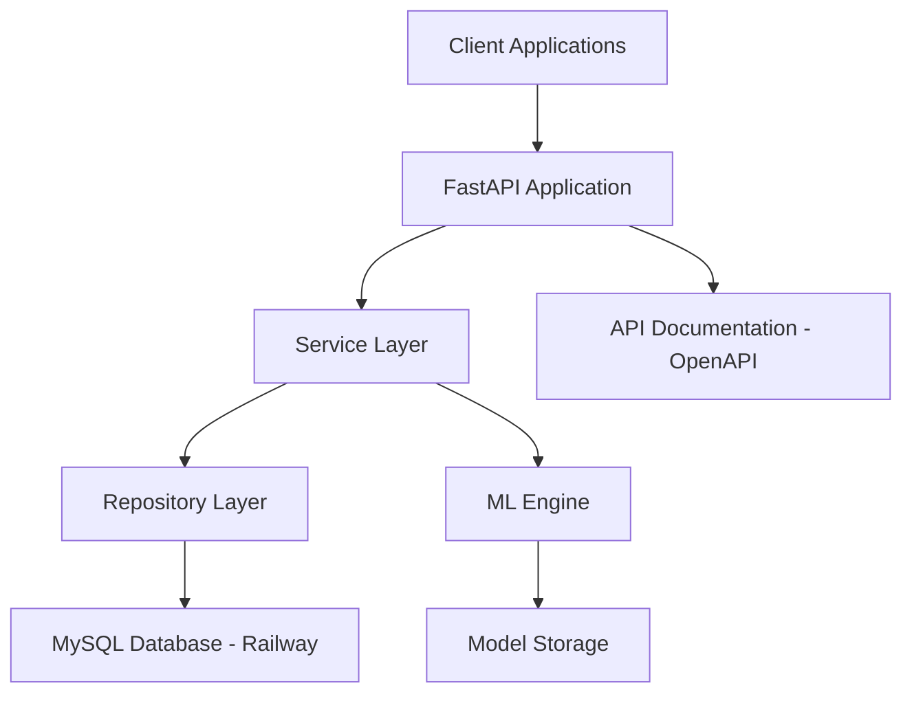

# Design Document

## Overview

The CNC Machine Learning Monitoring Application is a FastAPI-based backend system designed for Industry 4.0 manufacturing environments. The system connects to a Railway-hosted MySQL database containing CNC machine operational data and provides machine learning capabilities for predictive maintenance and performance optimization. The application follows a layered architecture with clear separation of concerns, implementing REST API endpoints for data access, ML model training, and analytics.

## Architecture

### High-Level Architecture



### Folder Structure

```
cnc-ml-monitoring/
├── app/
│   ├── __init__.py
│   ├── main.py                 # FastAPI application entry point
│   ├── config/
│   │   ├── __init__.py
│   │   ├── database.py         # Database configuration
│   │   └── settings.py         # Application settings
│   ├── models/
│   │   ├── __init__.py
│   │   ├── database_models.py  # SQLAlchemy models
│   │   └── pydantic_models.py  # Pydantic schemas
│   ├── repositories/
│   │   ├── __init__.py
│   │   ├── machine_repository.py
│   │   ├── operator_repository.py
│   │   ├── job_repository.py
│   │   └── part_repository.py
│   ├── services/
│   │   ├── __init__.py
│   │   ├── machine_service.py
│   │   ├── operator_service.py
│   │   ├── job_service.py
│   │   ├── part_service.py
│   │   ├── ml_service.py
│   │   └── analytics_service.py
│   ├── api/
│   │   ├── __init__.py
│   │   ├── dependencies.py
│   │   └── routes/
│   │       ├── __init__.py
│   │       ├── machines.py
│   │       ├── operators.py
│   │       ├── jobs.py
│   │       ├── parts.py
│   │       ├── ml_training.py
│   │       ├── predictions.py
│   │       └── analytics.py
│   └── ml/
│       ├── __init__.py
│       ├── feature_engineering.py
│       ├── models/
│       │   ├── __init__.py
│       │   ├── downtime_predictor.py
│       │   └── oee_optimizer.py
│       └── utils/
│           ├── __init__.py
│           ├── data_preprocessing.py
│           └── model_evaluation.py
├── tests/
│   ├── __init__.py
│   ├── test_api/
│   ├── test_services/
│   └── test_ml/
├── requirements.txt
├── .env.example
└── README.md
```

## Components and Interfaces

### Database Layer

**Database Configuration**
- **Connection**: Railway MySQL database (gondola.proxy.rlwy.net:21632)
- **Database**: railway
- **Table**: joblog_ob
- **Connection Pool**: SQLAlchemy with async support
- **ORM**: SQLAlchemy Core and ORM for database operations

**Database Model Schema**

```python
# Main job log table (existing data)
class JobLogOB(Base):
    __tablename__ = "joblog_ob"
    
    id = Column(Integer, primary_key=True, autoincrement=True)
    machine = Column(String(50), ForeignKey("machines.machine_id"), nullable=False)
    start_time = Column(DateTime, nullable=False)
    end_time = Column(DateTime, nullable=True)
    job_number = Column(String(50), ForeignKey("jobs.job_number"), nullable=False)
    state = Column(String(20), nullable=False)
    part_number = Column(String(50), ForeignKey("parts.part_number"), nullable=False)
    emp_id = Column(String(20), ForeignKey("operators.emp_id"), nullable=False)
    operator_name = Column(String(50), nullable=False)
    op_number = Column(Integer, nullable=False)
    parts_produced = Column(Integer, nullable=True)
    job_duration = Column(Integer, nullable=True)
    running_time = Column(Integer, nullable=True)
    setup_time = Column(Integer, nullable=True)
    waiting_setup_time = Column(Integer, nullable=True)
    not_feeding_time = Column(Integer, nullable=True)
    adjustment_time = Column(Integer, nullable=True)
    dressing_time = Column(Integer, nullable=True)
    tooling_time = Column(Integer, nullable=True)
    engineering_time = Column(Integer, nullable=True)
    maintenance_time = Column(Integer, nullable=True)
    buy_in_time = Column(Integer, nullable=True)
    break_shift_change_time = Column(Integer, nullable=True)
    idle_time = Column(Integer, nullable=True)
    
    # Relationships
    machine_ref = relationship("Machine", back_populates="job_logs")
    job_ref = relationship("Job", back_populates="job_logs")
    part_ref = relationship("Part", back_populates="job_logs")
    operator_ref = relationship("Operator", back_populates="job_logs")

# Auxiliary tables for better data normalization and ML features
class Machine(Base):
    __tablename__ = "machines"
    
    machine_id = Column(String(50), primary_key=True)
    machine_name = Column(String(100), nullable=False)
    machine_type = Column(String(50), nullable=False)
    manufacturer = Column(String(100), nullable=True)
    model = Column(String(100), nullable=True)
    year_installed = Column(Integer, nullable=True)
    max_spindle_speed = Column(Integer, nullable=True)
    max_feed_rate = Column(Float, nullable=True)
    work_envelope_x = Column(Float, nullable=True)
    work_envelope_y = Column(Float, nullable=True)
    work_envelope_z = Column(Float, nullable=True)
    maintenance_schedule_hours = Column(Integer, nullable=True)
    last_maintenance_date = Column(DateTime, nullable=True)
    status = Column(String(20), default="ACTIVE")
    created_at = Column(DateTime, default=datetime.utcnow)
    updated_at = Column(DateTime, default=datetime.utcnow, onupdate=datetime.utcnow)
    
    # Relationships
    job_logs = relationship("JobLogOB", back_populates="machine_ref")

class Operator(Base):
    __tablename__ = "operators"
    
    emp_id = Column(String(20), primary_key=True)
    operator_name = Column(String(100), nullable=False)
    skill_level = Column(String(20), nullable=True)  # BEGINNER, INTERMEDIATE, ADVANCED, EXPERT
    hire_date = Column(Date, nullable=True)
    shift_preference = Column(String(20), nullable=True)  # DAY, NIGHT, ROTATING
    certifications = Column(Text, nullable=True)  # JSON string of certifications
    hourly_rate = Column(Float, nullable=True)
    department = Column(String(50), nullable=True)
    supervisor_id = Column(String(20), nullable=True)
    status = Column(String(20), default="ACTIVE")
    created_at = Column(DateTime, default=datetime.utcnow)
    updated_at = Column(DateTime, default=datetime.utcnow, onupdate=datetime.utcnow)
    
    # Relationships
    job_logs = relationship("JobLogOB", back_populates="operator_ref")

class Job(Base):
    __tablename__ = "jobs"
    
    job_number = Column(String(50), primary_key=True)
    job_name = Column(String(200), nullable=False)
    customer_id = Column(String(50), nullable=True)
    customer_name = Column(String(200), nullable=True)
    priority = Column(String(20), default="NORMAL")  # LOW, NORMAL, HIGH, URGENT
    estimated_hours = Column(Float, nullable=True)
    actual_hours = Column(Float, nullable=True)
    quantity_ordered = Column(Integer, nullable=False)
    quantity_completed = Column(Integer, default=0)
    due_date = Column(DateTime, nullable=True)
    start_date = Column(DateTime, nullable=True)
    completion_date = Column(DateTime, nullable=True)
    job_status = Column(String(20), default="PENDING")  # PENDING, IN_PROGRESS, COMPLETED, CANCELLED
    complexity_rating = Column(Integer, nullable=True)  # 1-10 scale
    setup_complexity = Column(Integer, nullable=True)  # 1-10 scale
    created_at = Column(DateTime, default=datetime.utcnow)
    updated_at = Column(DateTime, default=datetime.utcnow, onupdate=datetime.utcnow)
    
    # Relationships
    job_logs = relationship("JobLogOB", back_populates="job_ref")

class Part(Base):
    __tablename__ = "parts"
    
    part_number = Column(String(50), primary_key=True)
    part_name = Column(String(200), nullable=False)
    part_description = Column(Text, nullable=True)
    material_type = Column(String(100), nullable=True)
    material_hardness = Column(String(50), nullable=True)
    weight = Column(Float, nullable=True)
    dimensions_length = Column(Float, nullable=True)
    dimensions_width = Column(Float, nullable=True)
    dimensions_height = Column(Float, nullable=True)
    tolerance_class = Column(String(20), nullable=True)
    surface_finish = Column(String(50), nullable=True)
    standard_cycle_time = Column(Integer, nullable=True)  # in seconds
    setup_time_standard = Column(Integer, nullable=True)  # in seconds
    tooling_requirements = Column(Text, nullable=True)  # JSON string
    quality_requirements = Column(Text, nullable=True)  # JSON string
    cost_per_unit = Column(Float, nullable=True)
    revision = Column(String(10), nullable=True)
    created_at = Column(DateTime, default=datetime.utcnow)
    updated_at = Column(DateTime, default=datetime.utcnow, onupdate=datetime.utcnow)
    
    # Relationships
    job_logs = relationship("JobLogOB", back_populates="part_ref")
```

### Repository Layer

**Repository Interfaces**

```python
class MachineRepository:
    async def get_all_machines() -> List[Machine]
    async def get_machine_by_id(machine_id: str) -> Optional[Machine]
    async def create_machine(machine_data: Dict) -> Machine
    async def update_machine(machine_id: str, machine_data: Dict) -> Machine
    async def get_machine_data(machine_id: str, start_date: datetime, end_date: datetime) -> List[JobLogOB]
    async def get_paginated_data(skip: int, limit: int, filters: Dict) -> Tuple[List[JobLogOB], int]
    async def get_downtime_data(machine_id: str, downtime_types: List[str]) -> List[Dict]
    async def get_machine_statistics(machine_id: str) -> Dict

class OperatorRepository:
    async def get_all_operators() -> List[Operator]
    async def get_operator_by_id(emp_id: str) -> Optional[Operator]
    async def create_operator(operator_data: Dict) -> Operator
    async def update_operator(emp_id: str, operator_data: Dict) -> Operator
    async def get_operator_performance(emp_id: str, start_date: datetime, end_date: datetime) -> Dict
    async def get_operators_by_skill_level(skill_level: str) -> List[Operator]

class JobRepository:
    async def get_all_jobs() -> List[Job]
    async def get_job_by_number(job_number: str) -> Optional[Job]
    async def create_job(job_data: Dict) -> Job
    async def update_job(job_number: str, job_data: Dict) -> Job
    async def get_jobs_by_status(status: str) -> List[Job]
    async def get_job_performance(job_number: str) -> Dict

class PartRepository:
    async def get_all_parts() -> List[Part]
    async def get_part_by_number(part_number: str) -> Optional[Part]
    async def create_part(part_data: Dict) -> Part
    async def update_part(part_number: str, part_data: Dict) -> Part
    async def get_parts_by_material(material_type: str) -> List[Part]
    async def get_part_production_history(part_number: str) -> List[Dict]
```

### Service Layer

**MachineService**
- Handles business logic for machine data operations
- Implements data validation and transformation
- Provides aggregation and filtering capabilities

**MLService**
- Manages machine learning model lifecycle
- Handles feature engineering and data preprocessing
- Implements model training, evaluation, and prediction workflows

**AnalyticsService**
- Calculates OEE (Overall Equipment Effectiveness) metrics
- Provides downtime analysis and pattern recognition
- Generates performance reports and KPIs

### API Layer

**Machine Data Endpoints**
- `GET /api/v1/machines` - List all machines
- `POST /api/v1/machines` - Create new machine
- `GET /api/v1/machines/{machine_id}` - Get machine details
- `PUT /api/v1/machines/{machine_id}` - Update machine information
- `GET /api/v1/machines/{machine_id}/data` - Get machine operational data
- `GET /api/v1/machines/{machine_id}/downtime` - Get downtime analysis
- `GET /api/v1/machines/{machine_id}/oee` - Get OEE metrics

**Operator Management Endpoints**
- `GET /api/v1/operators` - List all operators
- `POST /api/v1/operators` - Create new operator
- `GET /api/v1/operators/{emp_id}` - Get operator details
- `PUT /api/v1/operators/{emp_id}` - Update operator information
- `GET /api/v1/operators/{emp_id}/performance` - Get operator performance metrics
- `GET /api/v1/operators/by-skill/{skill_level}` - Get operators by skill level

**Job Management Endpoints**
- `GET /api/v1/jobs` - List all jobs
- `POST /api/v1/jobs` - Create new job
- `GET /api/v1/jobs/{job_number}` - Get job details
- `PUT /api/v1/jobs/{job_number}` - Update job information
- `GET /api/v1/jobs/by-status/{status}` - Get jobs by status
- `GET /api/v1/jobs/{job_number}/performance` - Get job performance metrics

**Part Management Endpoints**
- `GET /api/v1/parts` - List all parts
- `POST /api/v1/parts` - Create new part
- `GET /api/v1/parts/{part_number}` - Get part details
- `PUT /api/v1/parts/{part_number}` - Update part information
- `GET /api/v1/parts/by-material/{material_type}` - Get parts by material
- `GET /api/v1/parts/{part_number}/production-history` - Get part production history

**ML Training Endpoints**
- `POST /api/v1/ml/train/downtime-predictor` - Train downtime prediction model
- `POST /api/v1/ml/train/oee-optimizer` - Train OEE optimization model
- `GET /api/v1/ml/models` - List available models
- `GET /api/v1/ml/models/{model_id}/status` - Get training status

**Prediction Endpoints**
- `POST /api/v1/predictions/downtime` - Predict machine downtime
- `POST /api/v1/predictions/maintenance` - Predict maintenance needs
- `POST /api/v1/predictions/oee` - Predict OEE improvements

**Analytics Endpoints**
- `GET /api/v1/analytics/dashboard` - Get dashboard metrics
- `GET /api/v1/analytics/trends` - Get trend analysis
- `POST /api/v1/analytics/reports` - Generate custom reports

## Data Models

### Pydantic Request/Response Models

**MachineDataRequest**
```python
class MachineDataRequest(BaseModel):
    machine_id: Optional[str] = None
    start_date: datetime
    end_date: datetime
    include_downtime: bool = True
    page: int = 1
    page_size: int = 100
```

**MachineDataResponse**
```python
class MachineDataResponse(BaseModel):
    machine: str
    start_time: datetime
    end_time: Optional[datetime]
    job_number: str
    state: str
    parts_produced: Optional[int]
    running_time: Optional[int]
    downtime_breakdown: Dict[str, int]
    oee_metrics: OEEMetrics
```

**MLTrainingRequest**
```python
class MLTrainingRequest(BaseModel):
    model_type: str  # "downtime_predictor" or "oee_optimizer"
    training_data_filter: MachineDataRequest
    hyperparameters: Optional[Dict[str, Any]] = None
    validation_split: float = 0.2
```

**PredictionRequest**
```python
class PredictionRequest(BaseModel):
    machine_id: str
    features: Dict[str, Any]
    prediction_horizon: int  # hours
    confidence_threshold: float = 0.8
```

### Feature Engineering Schema

**Downtime Features**
- Time-based features: hour_of_day, day_of_week, shift_pattern
- Historical averages: avg_setup_time, avg_maintenance_time
- Trend features: downtime_trend, efficiency_trend
- Operational context: job_complexity, operator_experience

**OEE Calculation**
```python
class OEEMetrics(BaseModel):
    availability: float  # (Planned Production Time - Downtime) / Planned Production Time
    performance: float   # (Total Count / Run Time) / Ideal Run Rate
    quality: float       # Good Count / Total Count
    oee: float          # Availability × Performance × Quality
```

## Error Handling

### Database Error Handling
- Connection timeout and retry mechanisms
- Transaction rollback on failures
- Graceful degradation for read-only operations
- Connection pool management and monitoring

### API Error Handling
- Standardized error response format
- HTTP status code mapping
- Request validation error details
- Rate limiting and throttling

### ML Error Handling
- Model training failure recovery
- Prediction confidence thresholds
- Data quality validation
- Model performance monitoring

## Testing Strategy

### Unit Testing
- Repository layer: Database operations and queries
- Service layer: Business logic and data transformations
- ML components: Feature engineering and model evaluation
- API endpoints: Request/response validation

### Integration Testing
- Database connectivity and operations
- End-to-end API workflows
- ML pipeline integration
- External service dependencies

### Performance Testing
- Database query optimization
- API response times under load
- ML model training and prediction performance
- Memory usage and resource optimization

### Test Data Management
- Synthetic test data generation
- Database seeding for consistent testing
- ML model testing with known datasets
- API testing with mock data

## Security Considerations

### Database Security
- Encrypted connections to Railway MySQL
- Environment variable management for credentials
- SQL injection prevention through parameterized queries
- Database access logging and monitoring

### API Security
- Input validation and sanitization
- Rate limiting and DDoS protection
- API key authentication (future enhancement)
- CORS configuration for web clients

### Data Privacy
- Sensitive data handling procedures
- Audit logging for data access
- Data retention policies
- Compliance with manufacturing data standards

## Performance Optimization

### Database Optimization
- Indexing strategy for time-based queries
- Query optimization for large datasets
- Connection pooling configuration
- Caching frequently accessed data

### API Optimization
- Async/await patterns for I/O operations
- Response compression and pagination
- Background task processing for ML operations
- Caching strategies for computed metrics

### ML Optimization
- Efficient feature computation
- Model serialization and loading
- Batch prediction capabilities
- Memory-efficient data processing